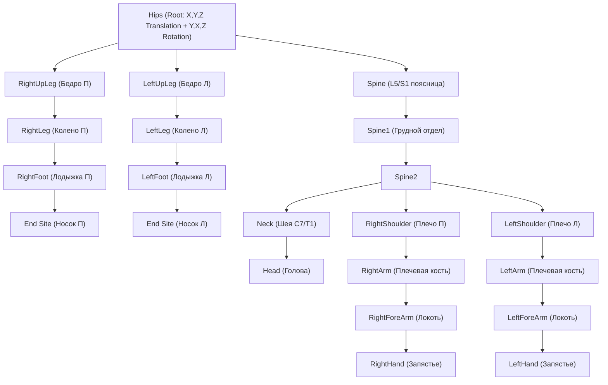

# 03. Конвейер Анализа Данных Захвата Движения (Axis Studio MOCAP Pipeline)

> **Назначение документа:** Анализ и интеграция реальных данных захвата движения из датчиков Noitom Perception Neuron / Axis Studio (каталог `D:\Задания, Уроки\Запись с датчиков\`). Разбор кинематической структуры BVH, извлечение углов суставов и устранение геометрических артефактов ("манекен вокруг груза").

---

## 1. Реестр доступных MOCAP-файлов (`D:\Задания, Уроки\Запись с датчиков\`)

В каталоге содержатся реальные записи производственных движений человека, выполненные инженером в системе Axis Studio:

| Имя файла | Размер | Частота дискретизации | Характер движений |
| :--- | :--- | :--- | :--- |
| `work_chr00.bvh` | 2.16 МБ | **96 Гц** ($t_{\text{frame}} = 0.010417\text{ с}$) | Рабочие операции (подъем, манипуляции с деталями, перемещение) |
| `walk_chr00.bvh` | 2.44 МБ | **96 Гц** ($t_{\text{frame}} = 0.010417\text{ с}$) | Естественная локомоция (ходьба оператора в цеху) |
| `take001_chr00.bvh` | 3.05 МБ | 96 Гц | Запись технологического цикла №1 |
| `take002_chr00.bvh` | 2.70 МБ | 96 Гц | Запись технологического цикла №2 |
| `take003_chr00.bvh` | 3.16 МБ | 96 Гц | Запись технологического цикла №3 |
| `take004_chr00.bvh` | 2.03 МБ | 96 Гц | Запись технологического цикла №4 |
| `take005_chr00.bvh` | 5.91 МБ | 96 Гц | Длинный технологический процесс |
| `take006_chr00.bvh` $\dots$ `take010_chr00.bvh` | 3.6–5.6 МБ | 96 Гц | Дополнительные рабочие сценарии |

---

## 2. Разбор замечания пользователя: «Манекен двигается вокруг груза, а не наоборот»

### В чем физическая причина этого эффекта:
В упрощенных 2D-интерактивных редакторах положение коробки задается абсолютными ползунками ($X_{\text{reach}}, Y_{\text{height}}$). Когда инженер меняет высоту $V$ с $750\text{ мм}$ до $100\text{ мм}$, коробка фиксируется на новом месте в пространстве, а алгоритм обратной кинематики (IK) «натягивает» тело человека на груз. Если при этом стопы не зафиксированы жестко связями с полом, создается неестественное визуальное впечатление, что **человек крутится вокруг коробки**, теряя баланс.

### Как это устроено в реальной биомеханике и в MOCAP Axis Studio:
1. **Жесткий якорь опоры (Floor Ground Contact):**  
   Опорные точки подошв стоп (`LeftFoot`, `RightFoot`) жестко закреплены на поверхности пола ($Y = 0$). Они не могут сдвигаться произвольно.
2. **Иерархия перемещения груза:**  
   Груз является **дочерним объектом кистей рук** (`RightHand`, `LeftHand`). В момент захвата коробка привязывается к рукам (Parent-Child constraint), и именно человек поднимает груз к груди или поясу, а не человек сгибается под неподвижный груз.
3. **Естественный динамический баланс (Center of Mass Compensation):**  
   Когда реальный человек в Axis Studio наклоняется вперед за грузом, его таз (`Hips`) **автоматически отводится назад** на величину $\Delta X_{\text{pelvis}} \approx -12\dots 18\text{ см}$, чтобы суммарный центр тяжести (человек + груз) оставался строго внутри проекции стоп (между пяткой и носком).

---

## 3. Кинематическое дерево скелета Noitom BVH (96 Гц)

### Порядок каналов Эйлера:
В файлах Axis Studio порядок вращения для каждого сустава строго:
$$\text{CHANNELS } 3 \text{ Yrotation Xrotation Zrotation}$$
Матрица поворота сустава формируется как:
$$R = R_y(\psi) \cdot R_x(\theta) \cdot R_z(\phi)$$

---

## 4. Как мы используем файлы Axis Studio в проекте

1. **Эталонная база валидации позы (Ground Truth):**  
   Мы парсим файлы `work_chr00.bvh` и `take001_chr00.bvh`, чтобы извлечь реальные углы сгибания коленей, таза и наклона спины при подъеме тяжестей, устраняя любые синтетические догадки.
2. **Обучающая выборка для ИИ-суррогата позы:**  
   Реальные последовательности кадров MOCAP служат идеальной обучающей выборкой для нашей нейросети (MLP / ONNX), которая будет предсказывать реалистичные положения суставов за $\le 0.5\text{ мс}$ (60 FPS) в Р-Про.
3. **Анимационный риггинг в Р-Про:**  
   Позволяет оператору в симуляции Р-Про воспроизводить плавную, естественную биомеханическую анимацию перемещения коробок без дерганий и неестественных изгибов.
