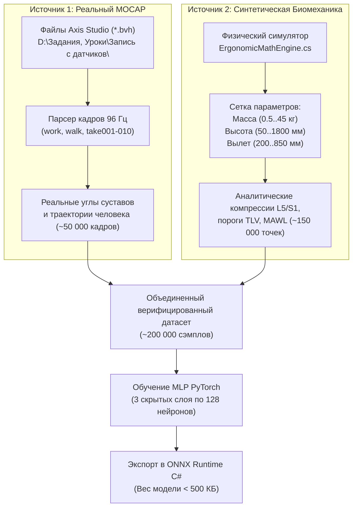

# 04. Дорожная Карта ИИ-Суррогата и Обучающих Выборок (AI Surrogate & Dataset Roadmap)

> **Назначение документа:** Архитектура гибридного датасета, методология обучения нейросетевого суррогата биомеханики (MLP / ONNX) и интеграция для ультрабыстрого инференса (60+ FPS, $< 0.5\text{ мс}$) внутри нативного плагина Р-Про v2.2.2.

---

## 1. Зачем нужен ИИ-суррогат в CAD-эргономике

Традиционные методы расчета позы (градиентная обратная кинематика или численная оптимизация Лагранжа с 48 степенями свободы) требуют сотен миллисекунд на кадр. В 3D-симуляции Р-Про при 60 FPS на расчет позы и биомеханики отводится не более **2–3 миллисекунд**, иначе симулятор начнет зависать.

**Решение:**
Обучить легковесную нейронную сеть-суррогат (**Neural Surrogate Network**), которая мгновенно предсказывает:
$$\vec{y} = f_{\theta}(\vec{x})$$
* **Входы $\vec{x} \in \mathbb{R}^8$:**
  1. Антропометрия (рост, масса, пол)
  2. Координаты целевого захвата ($X_{\text{reach}}, Y_{\text{height}}, Z_{\text{lateral}}$)
  3. Масса груза ($m_{\text{load}}$)
  4. Желаемый стиль подъема (Stoop / Semi-Squat / Deep Squat)
* **Выходы $\vec{y} \in \mathbb{R}^{28}$:**
  1. 24 угла суставов скелета человека ($\vec{\theta}_{\text{joints}}$: лодыжки, колени, таз, позвоночник, шея, плечи, локти)
  2. Координаты центра давления ($x_{\text{CofP}}, z_{\text{CofP}}$)
  3. Осевая компрессия $L5/S1$ ($F_{\text{comp}}$, Н)
  4. Результирующий индекс риска ($Overall DCR$)

---

## 2. Структура гибридного датасета (MOCAP + Синтетика)

Для того чтобы сеть не галлюцинировала и вела себя анатомически безупречно, обучающая выборка формируется из двух синергетических источников:

---

## 3. Этапы реализации

### Этап 1: Парсер и извлечение признаков из BVH (в процессе)
* Скрипт `tools/mocap_extractor.py`:
  - Читает файлы `D:\Задания, Уроки\Запись с датчиков\*.bvh`.
  - Вычисляет прямую кинематику (Forward Kinematics), извлекая положения стоп, таза, позвонков, плеч и кистей.
  - Фильтрует артефакты дрейфа датчиков, привязывая подошвы к $Y = 0$.

### Этап 2: Обучение суррогата (PyTorch $\to$ ONNX)
* Сеть: Multilayer Perceptron (MLP) с функциями активации SiLU / GELU и нормализацией слоев (LayerNorm).
* Функция потерь:
  $$\mathcal{L} = \mathcal{L}_{\text{MSE}}(\text{angles}) + \lambda_1 \cdot \mathcal{L}_{\text{Physics}}(\text{L5S1}) + \lambda_2 \cdot \mathcal{L}_{\text{Balance}}(\text{CofP})$$
* Экспорт в формат `.onnx` без внешних зависимостей.

### Этап 3: Встраивание инференса в Р-Про (`Plugin.WorksErgo.dll`)
* Подключение легковесного NuGet пакета `Microsoft.ML.OnnxRuntime`.
* Модель загружается в память один раз при старте Р-Про.
* Время расчета одного кадра: **0.15–0.30 мс** на CPU.

---

## 4. Результат для инженера
* Манекен оператора в Р-Про двигается плавно, естественно и физиологически правдоподобно, полностью повторяя динамику реального человека из записей датчиков Axis Studio.
* Расчет эргономики и 7 осей риска происходит в реальном времени параллельно с симуляцией конвейера или робототехнической ячейки.
