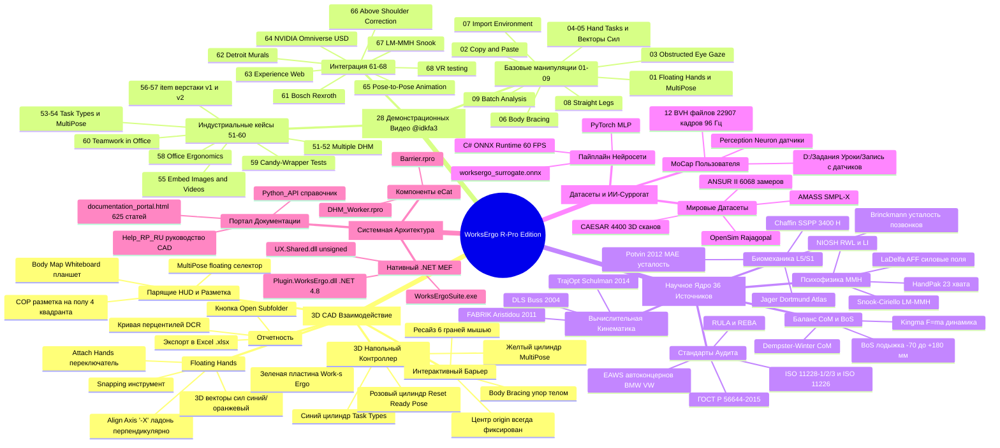

# Интеллект-Карта Экосистемы WorksErgo R-Pro Edition (Master Mind Map)

> **Назначение документа:** Центральный навигатор по всей экосистеме проекта «WorksErgo R-Pro Edition». Связывает воедино 3D-механику CAD, 28 видеоисследований, академическую базу из 36 первоисточников, датасеты, бинарные сборки и портал документации.

---

## 1. Графическая диаграмма связей (Mermaid Mind Map)

---

## 2. Индекс Ключевых Файлов и Ресурсов

### Раздел 0: Анализ 28 Видео
* 📄 [`knowledge_base/00_video_analysis/MASTER_28_VIDEOS_ANALYSIS.md`](file:///D:/Git/WorksErgoRPro/knowledge_base/00_video_analysis/MASTER_28_VIDEOS_ANALYSIS.md) — Исчерпывающий разбор механики, логики и визуального поведения всех 28 видео с временными метками.
* 📄 [`knowledge_base/00_video_analysis/all_28_videos.json`](file:///C:/Users/Jojo/.gemini/antigravity/scratch/all_28_videos.json) — Метаданные, описания и длительности видео.

### Раздел 1: Научные Труды и Датасеты
* 📄 [`knowledge_base/01_scientific_papers_and_datasets/SCIENTIFIC_REGISTRY_AND_DATASETS_INDEX.md`](file:///D:/Git/WorksErgoRPro/knowledge_base/01_scientific_papers_and_datasets/SCIENTIFIC_REGISTRY_AND_DATASETS_INDEX.md) — Мастер-реестр 36 первоисточников и датасетов.
* 📂 `D:\Задания, Уроки\Запись с датчиков\` — Локальный датасет пользователя (12 BVH-файлов, 22 907 кадров).
* 📂 `knowledge_base/02_datasets/` — ANSUR II (CSV-таблицы мужских и женских антропометрических параметров), OpenSim Rajagopal 2016/2023.

### Раздел 2: Бинарные Сборки и Контракты
* 📄 [`knowledge_base/02_rpro_and_vc_binaries/BINARIES_ARCHITECTURE_AND_API_DUMP.md`](file:///D:/Git/WorksErgoRPro/knowledge_base/02_rpro_and_vc_binaries/BINARIES_ARCHITECTURE_AND_API_DUMP.md) — Декомпиляция и архитектурный анализ.
* 📦 `knowledge_base/02_rpro_and_vc_binaries/Plugin.WorksErgoAPI.dll` — Оригинал Work(s) Ergo (облачный клиент).
* 📦 `knowledge_base/02_rpro_and_vc_binaries/Plugin.WorksErgo.dll` — Наше автономное локальное ядро Р-Про v2.2.2.
* 📦 `knowledge_base/02_rpro_and_vc_binaries/UX.Shared.dll` — Системная сборка Р-Про (v4.5.0.0, unsigned).

### Раздел 3: Портал Документации Р-Про и Visual Components
* 🌐 [`knowledge_base/03_cad_documentation_and_help/documentation_portal.html`](file:///D:/Git/WorksErgoRPro/knowledge_base/03_cad_documentation_and_help/documentation_portal.html) — **Интерактивный локальный поисковый портал** по 625 темам документации Р-Про и Visual Components.
* 📄 [`knowledge_base/03_cad_documentation_and_help/Temp_Help_Ergonomics_v0.1.html`](file:///D:/Git/WorksErgoRPro/knowledge_base/03_cad_documentation_and_help/Temp_Help_Ergonomics_v0.1.html) — Официальное руководство пользователя Work(s) Ergo по 3D-взаимодействию.
* 📄 [`knowledge_base/03_cad_documentation_and_help/Work(s) User Manual v1.17 (3).pdf`](file:///D:/Git/WorksErgoRPro/knowledge_base/03_cad_documentation_and_help/Work(s)%20User%20Manual%20v1.17%20(3).pdf) — 50-страничный регламент расчетов и формул.
* 📂 `knowledge_base/03_cad_documentation_and_help/Python_API/` — 222 декомпилированные страницы официального Python API Visual Components.
* 📂 `knowledge_base/03_cad_documentation_and_help/Help_RP_RU/` — 387 декомпилированных страниц полного руководства пользователя Р-Про.

### Раздел 4: Интеллект-Карта и Интерактивный Навигатор
* 🌐 [`knowledge_base/04_mindmap_and_master_navigator/interactive_mindmap.html`](file:///D:/Git/WorksErgoRPro/knowledge_base/04_mindmap_and_master_navigator/interactive_mindmap.html) — Интерактивная веб-версия интеллект-карты с фильтрацией и живыми переходами.
